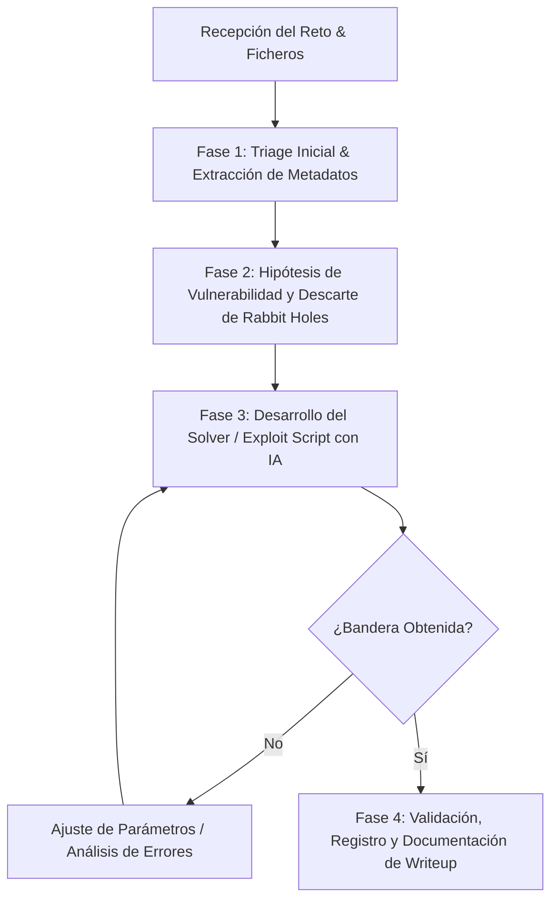

# Playbook Táctico CTF & Stack de Ciberseguridad: ANCI / HackRocks

Este documento define la metodología, patrones recurrentes, arsenal de herramientas y el flujo de trabajo colaborativo (Analista + IA) para resolver desafíos técnicos de CTF y trasladar estas capacidades a la monitorización y gobernanza en ciberseguridad empresarial.

---

## 1. Matriz de Patrones Recurrentes en HackRocks / CTFs Institucionales

Los CTFs organizados por agencias nacionales (como ANCI, INCIBE, etc.) y desplegados en plataformas como HackRocks tienden a simular **escenarios realistas con vulnerabilidades estándar y lógica empresarial**, evitando "trucos oscuros" (steganografía arbitraria) y priorizando buenas prácticas de auditoría:

| Categoría | Patrones Más Frecuentes | Vector Clave | Qué buscar de inmediato |
| :--- | :--- | :--- | :--- |
| **Web Exploitation** | - Broken Access Control (IDOR, BOLA) - Inyección de Comandos / SQLi / SSTI - Fallas de Lógica de Negocio - JWT mal firmados (alg: none, clave débil) - Fugas de código fuente (.git, .env, backups) | Headers, Cookies, Parámetros URL, Formularios, endpoints ocultos | `/robots.txt`, `/.git/`, comentarios HTML, cookies codificadas en Base64, tokens JWT |
| **Forense Digital** | - Análisis de PCAPs (Wireshark/tshark) - Volcados de memoria (Volatility 3) - Logs de servidores web/SSH/Auth - Extracción de artefactos corruptos | Tráfico no cifrado, pings sospechosos (ICMP tunnel), DNS tunneling | Credenciales en texto plano (HTTP, FTP), flujos TCP reensamblados, cadenas ocultas en metadatos |
| **Criptografía** | - RSA con factores débiles ($p \approx q$, $e=3$, Wiener) - Reutilización de One-Time Pad / XOR - Cifrados clásicos encadenados (Vigenère + Base64 + Rot13) - Hashes débiles (MD5/SHA1 con colisiones o diccionarios) | Longitud de llaves, exponente $e$, repetición de secuencias | `factordb`, CyberChef, solvers matemáticos (`z3`, `sympy`) |
| **Ingeniería Inversa** | - Binarios ELF/PE con validación de clave (Keygen/Crackme) - Algoritmos de verificación por XOR / matrices - Binarios "stripped" (sin símbolos de depuración) - Scripts ofuscados en Python bytecode o PowerShell | Funciones de comparación (`strcmp`, `memcmp`, saltos condicionales `jne`/`je`) | Ghidra, IDA, radare2, strings legibles, flujo de control en desensamblado |
| **Redes / Protocolos** | - Túneles DNS / ICMP - Ataques Man-in-the-Middle simulados - Análisis de protocolos industriales o IoT (Modbus, MQTT) | Peticiones periódicas, payloads en campos de padding | Conexiones anómalas, puertos no estándar, tráfico beaconing |
| **OSINT** | - Metadatos EXIF en imágenes / PDFs - Búsqueda en repositorios públicos (GitHub commits, WayBack Machine) - Geolocalización e información corporativa abierta | Fugas en commits anteriores, registros DNS históricos | `exiftool`, Google Dorks, `whois`, `sublist3r`, Wayback CDX |

---

## 2. Stack Tecnológico de Respuesta Rápida

Para maximizar la velocidad durante el evento, mantendremos este arsenal listo para ejecución directa:

### A. Entorno Python de Automatización (`requirements.txt`)
* `pwntools`: Manejo de conexiones de red TCP, interacción con servicios y payload crafting.
* `requests` / `httpx`: Auditoría y fuzzing de endpoints web.
* `z3-solver`: Resolución matemática automática de restricciones en retos de reversing y cripto.
* `cryptography` / `pycryptodome`: Cifrado, descifrado y operaciones aritméticas con módulos grandes.
* `scapy`: Manipulación y filtrado a bajo nivel de paquetes de red.

### B. Herramientas de Análisis Estático y Dinámico
* **CyberChef**: Decodificación multi-capa ultrarrápida.
* **Ghidra / Radare2 (r2)**: Descompilación y análisis estático de binarios.
* **GDB con GEF / Pwndbg**: Depuración dinámica de ejecutables.
* **TShark / Wireshark**: Filtrado rápido de tráfico por CLI.
* **Binwalk / Foremost**: Extracción de archivos embebidos.

---

## 3. Metodología de Resolución Asistida por IA (Paso a Paso)

### Paso 1: Triage Inmediato
* Se extraen los metadatos básicos (`file`, `strings -n 8`, `exiftool`, `binwalk`).
* Se revisa el enunciado en busca de pistas contextuales (nombres de variables, referencias históricas, formato de flag).

### Paso 2: Formulación de Hipótesis y Control de Tiempos
* La IA genera las **3 hipótesis más probables** de ataque.
* Se establece una regla de tiempo: si una línea de investigación no produce resultados en 10 minutos, se pivota a la siguiente hipótesis para evitar "rabbit holes".

### Paso 3: Construcción de Scripts y Automatización
* La IA redacta el script en Python adaptado a la arquitectura y lógica del reto.
* Ejecutamos el script localmente o contra el endpoint remoto para extraer el flag.

### Paso 4: Writeup y Registro
* Se guarda la solución en la bitácora con los pasos reproducibles y la lección aprendida.

---

## 4. De CTF a la Gobernanza y Monitorización Empresarial

El valor que demostraremos no es solo resolver acertijos, sino **evidenciar cómo este mismo enfoque de IA + Stack Técnico eleva la postura de ciberseguridad en una organización**:

1. **Triaje y Reducción del MTTD/MTTR:**
   * En un SOC, la IA analiza alertas masivas, correlaciona logs de firewall/EDR y descarta falsos positivos en segundos, igual que filtra un PCAP en el CTF.
2. **Auditoría Continua y Detección de Fugas:**
   * La misma lógica de reconocimiento de vulnerabilidades web (IDORs, credenciales en código, configuraciones inseguras) automatiza el escaneo de superficie de ataque expuesta.
3. **Cumplimiento y Gobernanza (Ley Marco N° 21.663 / ISO 27001):**
   * El sistema genera documentación técnica auditable, trazabilidad de incidentes y evidencias estructuradas listas para reportes ejecutivos o regulatorios ante la ANCI.
