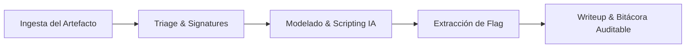

# 🛡️ AI-Augmented Cybersecurity & CTF Acceleration Framework

[](https://www.python.org/)
[]()
[]()
[]()

> **Framework de respuesta rápida, triage forense, ingeniería inversa y resolución de retos de ciberseguridad asistido por Inteligencia Artificial colaborativa (Human-in-the-Loop).**

---

## 🎯 Visión y Propósito

Este repositorio documenta el stack técnico, las metodologías de triage automatizado y los solvers utilizados para **competencias de CTF (Capture The Flag) y auditorías de seguridad práctica**.

Más allá del ámbito competitivo, este proyecto demuestra cómo la integración de **modelos avanzados de IA como copilotos de seguridad** acelera drásticamente las capacidades operativas de un equipo (Blue Team / Red Team / CSIRT), permitiendo:
1. **Reducción del MTTR (Mean Time to Respond):** De horas a minutos mediante scripting y desofuscación inmediata.
2. **Triage y Clasificación Forense:** Análisis automatizado de artefactos, firmas de binarios y capturas de tráfico.
3. **Gobernanza y Trazabilidad:** Generación de bitácoras técnicas reproducibles alineadas con los requerimientos de la **Ley Marco de Ciberseguridad N° 21.663** e **ISO 27001**.

---

## 📂 Estructura del Repositorio

```text
ctf/
├── 📄 PLAYBOOK_CTF_ANCI.md       # Metodología táctica, tiempos de rotación y patrones
├── 📄 requirements.txt           # Dependencias del stack analítico
├── 📁 tools/                     # Herramientas de triage automatizado
│   └── 🐍 triage.py              # Extractor de metadatos, magic bytes y flag hunter
├── 📁 templates/                 # Plantillas de scripts de explotación y solvers
│   ├── 🐍 tcp_solver_template.py # Interacción remota TCP / pwntools
│   └── 🐍 crypto_solvers.py      # Solvers de RSA (Fermat/Wiener), XOR y PRNG
└── 📁 challenges/                # Pruebas de concepto y writeups reproducibles
    └── 📁 01_crackme/            # Reversing y resolución matemática con Z3 Theorem Prover
```

---

## 🚀 Arsenal Técnico

| Dominio | Herramientas & Librerías | Aplicación Táctica |
| :--- | :--- | :--- |
| **Ingeniería Inversa** | `z3-solver`, Ghidra, radare2 | Modelado de restricciones algebraicas y desensamblado rápido |
| **Criptoanálisis** | `pycryptodome`, `sympy`, `factordb` | Factorización de módulos débiles, oráculos de padding y PRNGs |
| **Forense & Redes** | `scapy`, `tshark`, `binwalk` | Disección de protocolos, reconstrucción de streams y carving |
| **Seguridad Web** | `requests`, `httpx`, `beautifulsoup4` | Fuzzing dirigido, validación de IDORs y manipulación de JWT |

---

## ⚡ Flujo Operativo Asistido por IA



1. **Ingesta & Triage:** Inspección rápida con `triage.py` para descartar falsas pistas y clasificar el vector.
2. **Modelado Asistido:** Formulación matemática del problema (ej. teorema de restricciones Z3 o explotación de oráculo).
3. **Ejecución y Extracción:** Ejecución del solver en microsegundos contra el entorno de pruebas.
4. **Documentación:** Generación de writeup con pasos reproducibles y recomendaciones de mitigación.

---

## 🏆 Desafíos Resueltos & Solvers Automatizados

| # | Desafío | Vector / Categoría | Técnica / Solver | Bandera |
| :-: | :--- | :--- | :--- | :--- |
| **01** | `01_crackme` | Reversing / Math | Z3 Theorem Prover | `ANCI{ANCI-SFKK-2026!@}` |
| **02** | `02_secretos_compartidos` | Cryptography (DH) | Leaked Private Key $b$ | `academy{dh_s3cr3t_5d9c8fbe}` |
| **03** | `03_timestamp_aes` | Crypto / PRNG | Time-seeded AES-ECB Brute Force | `academy{sa3S_sEc9t_57326579}` |
| **04** | `04_rot13` | Crypto (Classical) | Double ROT-13 Decryption | `academy{next_time_I'll_try_2_rounds_of_rot13_5c5f5b36}` |
| **05** | `05_the_numbers` | Steganography / Crypto | A1Z26 Alphabet Index Cipher | `PICOCTF{THENUMBERSMASON}` |
| **06** | `06_multi_layer_decode` | Crypto / Encoding | Multi-layer Base64 + Caesar (+19) | `academy{caesar_d3cr9pt3d_9948dfa2}` |
| **07** | `07_metadata_key` | Forensics / Crypto | JPEG EXIF Hex RSA Private Key | `academy{rs4_k3y_1n_1mg_9db27b2c}` |
| **08** | `08_hashcrack` | Crypto / Network | Multi-round MD5 / SHA-1 / SHA-256 TCP | `academy{UseStr0nG_h@shEs_&PaSswDs!_062c2b77}` |
| **09** | `09_rsa_factoring` | Cryptography (RSA) | Weak RSA with Even Prime Factor $p=2$ | `academy{tw0_1$_pr!m3d832b35c}` |
| **10** | `10_rsa_small_d` | Cryptography (RSA) | Small Private Exponent $d$ (Wiener Attack) | `academy{sm4ll_d_073cf0e5}` |
| **11** | `11_web_twitter` | Web / Auth Bypass | Information Disclosure & Session Hijacking | `academy{s3t_s3ss10n_3xp1rat10n5_3a931aa0}` |
| **12** | `12_2fa_bypass` | Web / Auth Bypass | Leaked SQLite DB & Flask Cookie Tampering | `academy{n0_r4t3_n0_4uth_359dd2cb}` |
| **13** | `13_employee_id_hash` | Web / Access Control | MD5 Employee ID IDOR Enumeration | `academy{id0r_unl0ck_34378399}` |
| **14** | `14_secure_dot_product` | Crypto (Hard) | SHA-512 Length Extension + 32-Var Linear System | `academy{n0t_so_s3cure_.x_w1th_sh@512_41e4af34}` |
| **15** | `15_lattice_crypto` | Crypto (Hard / Lattice) | Kannan's Embedding + C-FLINT LLL Reduction | `academy{MSS_Advance_but_we_brought_it_back_and_made_it_harder!!!}` |

---

## 🛠️ Instalación y Uso Rápido

```bash
# Clonar repositorio
git clone <URL_DEL_REPOSITORIO>
cd ctf

# Instalar dependencias
pip install -r requirements.txt

# Ejecutar herramienta de triage
python tools/triage.py <ruta_del_archivo>

# Probar solver de ejemplo (Z3 Crackme)
python challenges/01_crackme/solve_crackme.py
```

---

## 👥 Equipo y Colaboración
Desarrollado y preparado para el **Ejercicio Nacional de Ciberseguridad ANCI 2026**.
* Operadores técnicos en tándem con **Antigravity (Google DeepMind)**.
